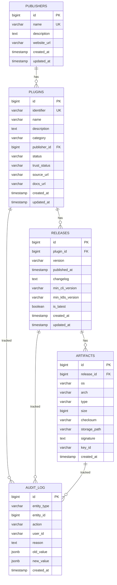

# Проектирование базы данных для Market Service

## 1. Назначение системы

**Market Service** — это сервис управления плагинами для системы K8S-MANAGER. Система предназначена для:

- **Разработчиков плагинов** — для публикации и управления своими плагинами
- **Администраторов системы** — для управления каталогом плагинов, модерации и контроля качества
- **Пользователей CLI** — для поиска, установки и обновления плагинов
- **Автоматизированных систем** — для интеграции с CI/CD процессами

Система обеспечивает централизованное хранение метаданных плагинов, их версий и артефактов, а также ведение истории изменений для аудита.

## 2. Функциональные требования

### 2.1. Управление издателями (Publishers)
- Регистрация нового издателя с указанием названия, описания и веб-сайта
- Получение информации об издателе
- Список всех издателей

### 2.2. Управление плагинами
- Регистрация нового плагина с указанием идентификатора, названия, описания, категории, издателя
- Получение информации о плагине по ID или идентификатору
- Поиск плагинов с фильтрацией по названию, категории, издателю, статусу доверия, статусу публикации
- Обновление метаданных плагина
- Изменение статуса плагина (активен/скрыт/заблокирован) с указанием причины

### 2.3. Управление версиями (Releases)
- Публикация новой версии плагина с указанием номера версии, changelog, требований совместимости
- Получение информации о версии
- Список всех версий плагина с сортировкой
- Получение последней версии плагина
- Автоматическое управление флагом "latest" (только одна версия может быть latest)

### 2.4. Управление артефактами
- Загрузка артефакта для конкретной версии, ОС и архитектуры
- Хранение метаданных артефакта (размер, контрольная сумма SHA-256, путь к файлу)
- Получение артефакта по ID или по платформе (OS/Arch)
- Список всех артефактов версии
- Удаление артефакта с указанием причины

### 2.5. Аудит и история изменений
- Автоматическое логирование всех операций создания, обновления, удаления
- Логирование изменений статусов с указанием причины
- Хранение старых и новых значений для операций обновления
- Возможность получения истории изменений для любой сущности

### 2.6. Нефункциональные требования
- **Производительность**: поддержка поиска и фильтрации с индексами
- **Целостность данных**: использование внешних ключей и ограничений
- **Аудит**: полная история всех изменений
- **Масштабируемость**: нормализованная структура для минимизации избыточности

## 3. Предварительная схема БД (ER-диаграмма)



## 4. Текстовые ограничения на данные

### 4.1. Ограничения целостности

1. **Publishers (Издатели)**
   - Каждый издатель имеет уникальное название
   - Издатель может иметь 0 или более плагинов
   - При удалении издателя запрещено удаление, если у него есть плагины (ON DELETE RESTRICT)

2. **Plugins (Плагины)**
   - Каждый плагин имеет уникальный идентификатор
   - Каждый плагин принадлежит ровно одному издателю
   - Плагин может иметь 0 или более версий (releases)
   - Статус плагина может быть только: 'active', 'hidden', 'blocked'
   - Статус доверия может быть только: 'official', 'verified', 'community'

3. **Releases (Версии)**
   - Каждая версия принадлежит ровно одному плагину
   - Для каждого плагина комбинация (plugin_id, version) уникальна
   - Версия может иметь 0 или более артефактов
   - Для каждого плагина только одна версия может иметь is_latest = TRUE
   - При удалении плагина все его версии удаляются каскадно (ON DELETE CASCADE)

4. **Artifacts (Артефакты)**
   - Каждый артефакт принадлежит ровно одной версии
   - Для каждой версии комбинация (release_id, os, arch) уникальна
   - Контрольная сумма (checksum) обязательна и имеет формат SHA-256 (64 символа)
   - При удалении версии все её артефакты удаляются каскадно (ON DELETE CASCADE)

5. **Audit Log (Аудит)**
   - Каждая запись относится к одной сущности (plugin, release, artifact)
   - Действие может быть: 'create', 'update', 'delete', 'status_change'
   - При обновлении должны быть заполнены и old_value, и new_value
   - При удалении должна быть указана причина (reason)

## 5. Функциональные и многозначные зависимости

### 5.1. Функциональные зависимости (FD)

#### Таблица PUBLISHERS
- `id → name, description, website_url, created_at, updated_at`
- `name → id` (из-за UNIQUE)

#### Таблица PLUGINS
- `id → identifier, name, description, category, publisher_id, status, trust_status, source_url, docs_url, created_at, updated_at`
- `identifier → id` (из-за UNIQUE)
- `publisher_id → id` (из-за FK)

#### Таблица RELEASES
- `id → plugin_id, version, published_at, changelog, min_cli_version, min_k8s_version, is_latest, created_at, updated_at`
- `(plugin_id, version) → id` (из-за UNIQUE)
- `plugin_id → id` (из-за FK)

#### Таблица ARTIFACTS
- `id → release_id, os, arch, type, size, checksum, storage_path, signature, key_id, created_at`
- `(release_id, os, arch) → id` (из-за UNIQUE)
- `release_id → id` (из-за FK)

#### Таблица AUDIT_LOG
- `id → entity_type, entity_id, action, user_id, reason, old_value, new_value, created_at`
- `(entity_type, entity_id) → id` (частично, через индекс)

### 5.2. Многозначные зависимости (MVD)

В нормализованной схеме многозначные зависимости отсутствуют, так как:
- Все связи между сущностями реализованы через внешние ключи
- Нет атрибутов, которые могут иметь множественные значения для одной записи
- JSONB поля (old_value, new_value) в audit_log не создают MVD, так как они атомарны на уровне строки

## 6. Нормализация схемы БД

### 6.1. Первая нормальная форма (1NF)

Все таблицы находятся в 1NF:
- Все атрибуты атомарны
- Нет повторяющихся групп
- Каждая строка уникальна (есть первичный ключ)

### 6.2. Вторая нормальная форма (2NF)

Все таблицы находятся в 2NF:
- Все таблицы находятся в 1NF
- Все неключевые атрибуты полностью зависят от первичного ключа
- Нет частичных зависимостей от составного ключа

**Пример проверки для RELEASES:**
- Первичный ключ: `id`
- Все атрибуты (plugin_id, version, published_at, ...) полностью зависят от `id`
- UNIQUE(plugin_id, version) не создает частичной зависимости, так как это ограничение уникальности, а не часть PK

### 6.3. Третья нормальная форма (3NF)

Все таблицы находятся в 3NF:
- Все таблицы находятся в 2NF
- Нет транзитивных зависимостей

**Проверка транзитивных зависимостей:**

**PLUGINS:**
- `id → publisher_id → publisher.name` - но publisher.name не хранится в PLUGINS, связь через FK
- ✅ Нет транзитивных зависимостей

**RELEASES:**
- `id → plugin_id → plugin.name` - но plugin.name не хранится в RELEASES
- ✅ Нет транзитивных зависимостей

**ARTIFACTS:**
- `id → release_id → release.version` - но release.version не хранится в ARTIFACTS
- ✅ Нет транзитивных зависимостей

### 6.4. Нормальная форма Бойса-Кодда (BCNF)

Все таблицы находятся в BCNF:
- Все таблицы находятся в 3NF
- Каждая детерминанта является потенциальным ключом

**Проверка:**
- Все функциональные зависимости имеют в левой части либо первичный ключ, либо уникальный ключ
- ✅ Схема в BCNF

### 6.5. Четвертая нормальная форма (4NF)

Все таблицы находятся в 4NF:
- Все таблицы находятся в BCNF
- Нет нетривиальных многозначных зависимостей

**Проверка:**
- Нет атрибутов, которые могут иметь множественные независимые значения
- ✅ Схема в 4NF

## 7. Пример недонормализованной схемы и аномалии

### 7.1. Недонормализованная схема

Рассмотрим альтернативную схему, где информация об издателе хранится непосредственно в таблице PLUGINS:

```sql
-- НЕПРАВИЛЬНО: Недонормализованная схема
CREATE TABLE plugins_denormalized (
    id BIGSERIAL PRIMARY KEY,
    identifier VARCHAR(255) UNIQUE NOT NULL,
    name VARCHAR(255) NOT NULL,
    publisher_name VARCHAR(255) NOT NULL,  -- Дублирование данных
    publisher_description TEXT,            -- Дублирование данных
    publisher_website VARCHAR(512),        -- Дублирование данных
    category VARCHAR(100),
    status VARCHAR(20),
    -- ... другие поля
);
```

### 7.2. Аномалии обновления

**Проблема:** Если издатель меняет своё название или описание, нужно обновить все записи плагинов этого издателя.

**Пример аномалии:**
```sql
-- Издатель "Kubernetes Inc" меняет название на "K8s Foundation"
-- В нормализованной схеме:
UPDATE publishers SET name = 'K8s Foundation' WHERE id = 1;
-- Одно обновление, автоматически отражается во всех связанных плагинах

-- В недонормализованной схеме:
UPDATE plugins_denormalized 
SET publisher_name = 'K8s Foundation',
    publisher_description = 'New description'
WHERE publisher_name = 'Kubernetes Inc';
-- Нужно обновить ВСЕ записи плагинов (может быть сотни/тысячи)
-- Если забыть обновить хотя бы одну запись - данные станут неконсистентными
```

**Результат:** Данные становятся неконсистентными, если обновление выполнено не полностью.

### 7.3. Аномалии удаления

**Проблема:** При удалении плагина теряется информация об издателе, если это был последний плагин.

**Пример аномалии:**
```sql
-- В недонормализованной схеме:
DELETE FROM plugins_denormalized WHERE id = 123;
-- Если это был последний плагин издателя, информация об издателе теряется навсегда

-- В нормализованной схеме:
DELETE FROM plugins WHERE id = 123;
-- Информация об издателе сохраняется в таблице publishers
-- Можно восстановить историю или использовать для других плагинов
```

### 7.4. Аномалии вставки

**Проблема:** Невозможно создать издателя без плагина, или нужно вставлять NULL/пустые значения.

**Пример аномалии:**
```sql
-- В недонормализованной схеме нельзя создать издателя без плагина:
-- Нужно либо вставить "пустой" плагин, либо хранить издателей отдельно

-- В нормализованной схеме:
INSERT INTO publishers (name, description) VALUES ('New Publisher', 'Description');
-- Можно создать издателя, а плагины добавить позже
```

## 8. SQL DDL - Создание схемы БД

### 8.1. Таблица Publishers

```sql
CREATE TABLE IF NOT EXISTS publishers (
    id BIGSERIAL PRIMARY KEY,
    name VARCHAR(255) NOT NULL UNIQUE,
    description TEXT,
    website_url VARCHAR(512),
    created_at TIMESTAMP NOT NULL DEFAULT NOW(),
    updated_at TIMESTAMP NOT NULL DEFAULT NOW()
);

CREATE INDEX IF NOT EXISTS idx_publishers_name ON publishers(name);
```

### 8.2. Таблица Plugins

```sql
CREATE TABLE IF NOT EXISTS plugins (
    id BIGSERIAL PRIMARY KEY,
    identifier VARCHAR(255) NOT NULL UNIQUE,
    name VARCHAR(255) NOT NULL,
    description TEXT,
    category VARCHAR(100),
    publisher_id BIGINT NOT NULL REFERENCES publishers(id) ON DELETE RESTRICT,
    status VARCHAR(20) NOT NULL DEFAULT 'active' 
        CHECK (status IN ('active', 'hidden', 'blocked')),
    trust_status VARCHAR(20) NOT NULL DEFAULT 'community' 
        CHECK (trust_status IN ('official', 'verified', 'community')),
    source_url VARCHAR(512),
    docs_url VARCHAR(512),
    created_at TIMESTAMP NOT NULL DEFAULT NOW(),
    updated_at TIMESTAMP NOT NULL DEFAULT NOW()
);

CREATE INDEX IF NOT EXISTS idx_plugins_identifier ON plugins(identifier);
CREATE INDEX IF NOT EXISTS idx_plugins_name ON plugins(name);
CREATE INDEX IF NOT EXISTS idx_plugins_category ON plugins(category);
CREATE INDEX IF NOT EXISTS idx_plugins_publisher_id ON plugins(publisher_id);
CREATE INDEX IF NOT EXISTS idx_plugins_status ON plugins(status);
CREATE INDEX IF NOT EXISTS idx_plugins_trust_status ON plugins(trust_status);
```

### 8.3. Таблица Releases

```sql
CREATE TABLE IF NOT EXISTS releases (
    id BIGSERIAL PRIMARY KEY,
    plugin_id BIGINT NOT NULL REFERENCES plugins(id) ON DELETE CASCADE,
    version VARCHAR(50) NOT NULL,
    published_at TIMESTAMP NOT NULL DEFAULT NOW(),
    changelog TEXT,
    min_cli_version VARCHAR(50),
    min_k8s_version VARCHAR(50),
    is_latest BOOLEAN NOT NULL DEFAULT FALSE,
    created_at TIMESTAMP NOT NULL DEFAULT NOW(),
    updated_at TIMESTAMP NOT NULL DEFAULT NOW(),
    UNIQUE(plugin_id, version)
);

CREATE INDEX IF NOT EXISTS idx_releases_plugin_id ON releases(plugin_id);
CREATE INDEX IF NOT EXISTS idx_releases_version ON releases(version);
CREATE INDEX IF NOT EXISTS idx_releases_published_at ON releases(published_at DESC);
CREATE INDEX IF NOT EXISTS idx_releases_is_latest 
    ON releases(plugin_id, is_latest) WHERE is_latest = TRUE;
```

### 8.4. Таблица Artifacts

```sql
CREATE TABLE IF NOT EXISTS artifacts (
    id BIGSERIAL PRIMARY KEY,
    release_id BIGINT NOT NULL REFERENCES releases(id) ON DELETE CASCADE,
    os VARCHAR(50) NOT NULL,
    arch VARCHAR(50) NOT NULL,
    type VARCHAR(50) NOT NULL DEFAULT 'binary',
    size BIGINT NOT NULL,
    checksum VARCHAR(64) NOT NULL, -- SHA-256
    storage_path VARCHAR(512) NOT NULL,
    signature TEXT,
    key_id VARCHAR(255),
    created_at TIMESTAMP NOT NULL DEFAULT NOW(),
    UNIQUE(release_id, os, arch)
);

CREATE INDEX IF NOT EXISTS idx_artifacts_release_id ON artifacts(release_id);
CREATE INDEX IF NOT EXISTS idx_artifacts_platform ON artifacts(os, arch);
CREATE INDEX IF NOT EXISTS idx_artifacts_checksum ON artifacts(checksum);
```

### 8.5. Таблица Audit Log

```sql
CREATE TABLE IF NOT EXISTS audit_log (
    id BIGSERIAL PRIMARY KEY,
    entity_type VARCHAR(50) NOT NULL,
    entity_id BIGINT NOT NULL,
    action VARCHAR(50) NOT NULL,
    user_id VARCHAR(255),
    reason TEXT,
    old_value JSONB,
    new_value JSONB,
    created_at TIMESTAMP NOT NULL DEFAULT NOW()
);

CREATE INDEX IF NOT EXISTS idx_audit_log_entity 
    ON audit_log(entity_type, entity_id);
CREATE INDEX IF NOT EXISTS idx_audit_log_user_id ON audit_log(user_id);
CREATE INDEX IF NOT EXISTS idx_audit_log_created_at 
    ON audit_log(created_at DESC);
```

## 9. SQL DML - Запросы, реализующие функциональные требования

### 9.1. Управление издателями

#### Создание издателя
```sql
INSERT INTO publishers (name, description, website_url)
VALUES ('Kubernetes Inc', 'Official Kubernetes plugins', 'https://kubernetes.io')
RETURNING id, created_at, updated_at;
```

#### Получение издателя по ID
```sql
SELECT id, name, description, website_url, created_at, updated_at
FROM publishers
WHERE id = $1;
```

#### Список издателей с пагинацией
```sql
-- Подсчет общего количества
SELECT COUNT(*) FROM publishers;

-- Получение списка
SELECT id, name, description, website_url, created_at, updated_at
FROM publishers
ORDER BY name
LIMIT $1 OFFSET $2;
```

### 9.2. Управление плагинами

#### Создание плагина
```sql
INSERT INTO plugins (
    identifier, name, description, category, publisher_id,
    status, trust_status, source_url, docs_url
)
VALUES ($1, $2, $3, $4, $5, $6, $7, $8, $9)
RETURNING id, created_at, updated_at;
```

#### Получение плагина по ID
```sql
SELECT id, identifier, name, description, category, publisher_id,
       status, trust_status, source_url, docs_url, created_at, updated_at
FROM plugins
WHERE id = $1;
```

#### Получение плагина по идентификатору
```sql
SELECT id, identifier, name, description, category, publisher_id,
       status, trust_status, source_url, docs_url, created_at, updated_at
FROM plugins
WHERE identifier = $1;
```

#### Поиск плагинов с фильтрацией
```sql
-- Построение условий динамически
SELECT id, identifier, name, description, category, publisher_id,
       status, trust_status, source_url, docs_url, created_at, updated_at
FROM plugins
WHERE 
    ($1::text IS NULL OR name ILIKE '%' || $1 || '%')
    AND ($2::text IS NULL OR category = $2)
    AND ($3::bigint IS NULL OR publisher_id = $3)
    AND ($4::text IS NULL OR trust_status = $4)
    AND ($5::text IS NULL OR status = $5)
ORDER BY created_at DESC
LIMIT $6 OFFSET $7;
```

#### Обновление метаданных плагина
```sql
UPDATE plugins
SET name = $2, description = $3, category = $4,
    source_url = $5, docs_url = $6, updated_at = NOW()
WHERE id = $1
RETURNING updated_at;
```

#### Изменение статуса плагина
```sql
UPDATE plugins
SET status = $2, updated_at = NOW()
WHERE id = $1;

-- Логирование в audit_log
INSERT INTO audit_log (entity_type, entity_id, action, reason, new_value)
VALUES ('plugin', $1, 'status_change', $3, 
        jsonb_build_object('status', $2));
```

### 9.3. Управление версиями

#### Создание версии (с транзакцией)
```sql
BEGIN;

-- Проверка существования версии
SELECT id FROM releases 
WHERE plugin_id = $1 AND version = $2;

-- Если не существует, создаем
INSERT INTO releases (
    plugin_id, version, published_at, changelog,
    min_cli_version, min_k8s_version, is_latest
)
VALUES ($1, $2, NOW(), $3, $4, $5, $6)
RETURNING id, created_at, updated_at;

-- Если is_latest = TRUE, сбрасываем флаги у других версий
UPDATE releases
SET is_latest = FALSE
WHERE plugin_id = $1 AND id != (SELECT id FROM releases WHERE ...);

COMMIT;
```

#### Получение версии по ID
```sql
SELECT id, plugin_id, version, published_at, changelog,
       min_cli_version, min_k8s_version, is_latest,
       created_at, updated_at
FROM releases
WHERE id = $1;
```

#### Список версий плагина
```sql
SELECT id, plugin_id, version, published_at, changelog,
       min_cli_version, min_k8s_version, is_latest,
       created_at, updated_at
FROM releases
WHERE plugin_id = $1
ORDER BY published_at DESC
LIMIT $2 OFFSET $3;
```

#### Получение последней версии
```sql
SELECT id, plugin_id, version, published_at, changelog,
       min_cli_version, min_k8s_version, is_latest,
       created_at, updated_at
FROM releases
WHERE plugin_id = $1 AND is_latest = TRUE
ORDER BY published_at DESC
LIMIT 1;
```

### 9.4. Управление артефактами

#### Создание артефакта
```sql
INSERT INTO artifacts (
    release_id, os, arch, type, size, checksum,
    storage_path, signature, key_id
)
VALUES ($1, $2, $3, $4, $5, $6, $7, $8, $9)
RETURNING id, created_at;
```

#### Получение артефакта по ID
```sql
SELECT id, release_id, os, arch, type, size, checksum,
       storage_path, signature, key_id, created_at
FROM artifacts
WHERE id = $1;
```

#### Получение артефакта по платформе
```sql
SELECT id, release_id, os, arch, type, size, checksum,
       storage_path, signature, key_id, created_at
FROM artifacts
WHERE release_id = $1 AND os = $2 AND arch = $3;
```

#### Список артефактов версии
```sql
SELECT id, release_id, os, arch, type, size, checksum,
       storage_path, signature, key_id, created_at
FROM artifacts
WHERE release_id = $1
ORDER BY os, arch;
```

#### Удаление артефакта
```sql
-- Логирование перед удалением
INSERT INTO audit_log (entity_type, entity_id, action, reason, old_value)
SELECT 'artifact', id, 'delete', $2,
       jsonb_build_object(
           'id', id, 'release_id', release_id,
           'os', os, 'arch', arch, 'size', size
       )
FROM artifacts
WHERE id = $1;

-- Удаление
DELETE FROM artifacts WHERE id = $1;
```

### 9.5. Аудит

#### Получение истории изменений сущности
```sql
SELECT id, entity_type, entity_id, action, user_id, reason,
       old_value, new_value, created_at
FROM audit_log
WHERE entity_type = $1 AND entity_id = $2
ORDER BY created_at DESC
LIMIT $3 OFFSET $4;
```

#### Логирование создания
```sql
INSERT INTO audit_log (entity_type, entity_id, action, user_id, new_value)
VALUES ($1, $2, 'create', $3, $4::jsonb);
```

#### Логирование обновления
```sql
INSERT INTO audit_log (
    entity_type, entity_id, action, user_id, old_value, new_value
)
VALUES ($1, $2, 'update', $3, $4::jsonb, $5::jsonb);
```

## 10. Транзакции

### 10.1. Транзакция создания релиза с установкой latest

```sql
BEGIN;

-- 1. Проверка существования версии
DO $$
DECLARE
    existing_id BIGINT;
BEGIN
    SELECT id INTO existing_id
    FROM releases
    WHERE plugin_id = $1 AND version = $2;
    
    IF existing_id IS NOT NULL THEN
        RAISE EXCEPTION 'Release with version % already exists', $2;
    END IF;
END $$;

-- 2. Создание релиза
INSERT INTO releases (
    plugin_id, version, published_at, changelog,
    min_cli_version, min_k8s_version, is_latest
)
VALUES ($1, $2, NOW(), $3, $4, $5, $6)
RETURNING id INTO release_id_var;

-- 3. Если is_latest = TRUE, сброс флагов у других версий
IF $6 = TRUE THEN
    UPDATE releases
    SET is_latest = FALSE
    WHERE plugin_id = $1 AND id != release_id_var;
END IF;

-- 4. Логирование в audit
INSERT INTO audit_log (entity_type, entity_id, action, user_id, new_value)
VALUES ('release', release_id_var, 'create', $7, 
        jsonb_build_object('version', $2, 'plugin_id', $1));

COMMIT;
```

### 10.2. Транзакция удаления артефакта с логированием

```sql
BEGIN;

-- 1. Получение данных артефакта для логирования
SELECT id, release_id, os, arch, type, size, checksum
INTO artifact_data
FROM artifacts
WHERE id = $1;

IF artifact_data IS NULL THEN
    RAISE EXCEPTION 'Artifact not found';
END IF;

-- 2. Логирование удаления
INSERT INTO audit_log (entity_type, entity_id, action, user_id, reason, old_value)
VALUES (
    'artifact', 
    $1, 
    'delete', 
    $2,  -- user_id
    $3,  -- reason
    jsonb_build_object(
        'id', artifact_data.id,
        'release_id', artifact_data.release_id,
        'os', artifact_data.os,
        'arch', artifact_data.arch,
        'size', artifact_data.size,
        'checksum', artifact_data.checksum
    )
);

-- 3. Удаление артефакта
DELETE FROM artifacts WHERE id = $1;

COMMIT;
```

### 10.3. Транзакция обновления статуса плагина

```sql
BEGIN;

-- 1. Получение текущего статуса
SELECT status INTO old_status
FROM plugins
WHERE id = $1;

IF old_status IS NULL THEN
    RAISE EXCEPTION 'Plugin not found';
END IF;

-- 2. Обновление статуса
UPDATE plugins
SET status = $2, updated_at = NOW()
WHERE id = $1;

-- 3. Логирование изменения
INSERT INTO audit_log (
    entity_type, entity_id, action, user_id, reason, old_value, new_value
)
VALUES (
    'plugin',
    $1,
    'status_change',
    $3,  -- user_id
    $4,  -- reason
    jsonb_build_object('status', old_status),
    jsonb_build_object('status', $2)
);

COMMIT;
```

## 11. Заключение

Спроектированная база данных:

1. ✅ **Полностью нормализована** до 4NF, что исключает аномалии обновления, удаления и вставки
2. ✅ **Обеспечивает целостность данных** через внешние ключи и ограничения
3. ✅ **Поддерживает все функциональные требования** через соответствующие SQL запросы
4. ✅ **Обеспечивает аудит** всех операций для отслеживания изменений
5. ✅ **Оптимизирована для производительности** через индексы на часто используемых полях
6. ✅ **Масштабируема** благодаря нормализованной структуре

Схема готова к использованию в production среде и может быть расширена при необходимости без нарушения целостности данных.

